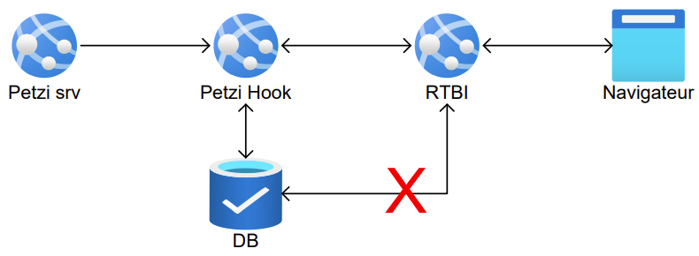

<div id="top">

<!-- HEADER STYLE: CLASSIC -->
<div align="center">

# PETZI-DASHBOARD

<em></em>

<!-- BADGES -->
<!-- local repository, no metadata badges. -->

<em>Built with the tools and technologies:</em>


<br>


</div>
<br>

## Table of Contents

- [Table of Contents](#table-of-contents)
- [Overview](#overview)
- [Features](#features)
- [Project Structure](#project-structure)
- [Getting Started](#getting-started)
    - [Prerequisites](#prerequisites)
    - [Installation](#installation)
    - [Usage](#usage)
- [Contributing](#contributing)

## Overview

Petzi is a modular application designed to process and visualize concert ticket sales data in real-time. It enables event managers to monitor sales activity live and adapt their marketing and distribution strategies based on up-to-date analytics.

The application is composed of several modules:

- **PetziHook**: A Spring Boot server handling webhook events.

- **RTBI**: A real-time processing module that pushes updates to clients via Server-Sent Events (SSE).

- **Dashboard**: A front-end dashboard for visualizing real-time sales data.

- **Common**: A shared library containing business logic and utility code used across modules.

Together, these modules provide a complete pipeline from event ingestion to live data insights, allowing for smarter decision-making in the event industry.



## Features

- 📡 **Real-Time Ticket Sales Processing** via Kafka and SSE  
- 🔔 **Live Webhook Handling** for instant event updates  
- 📊 **Interactive Dashboard** to track and visualize ticketing data  
- ♻️ **Modular Design** allowing independent development and deployment of each component  
- 🔧 **Dockerized Setup** for local development and integration  

## 🖼️ Screenshots

<p align="center">
  
  <br>
  <em>Demo</em>
</p>

## Project Structure

```sh
└── Petzi-Dashboard/
    ├── Common
    │   ├── .gitignore
    │   ├── pom.xml
    │   ├── README.md
    │   └── src
    ├── Dashboard
    │   ├── .gitignore
    │   ├── CHANGELOG.md
    │   ├── index.html
    │   ├── package-lock.json
    │   ├── package.json
    │   ├── pom.xml
    │   ├── postcss.config.cjs
    │   ├── public
    │   ├── README.md
    │   ├── src
    │   └── vite.config.js
    ├── Docker
    │   ├── docker-compose.kraft-cluster.yml
    │   ├── docker-compose.yml
    │   ├── kafka-ui-config.kraft-cluster.yml
    │   └── kafka-ui-config.yml
    ├── Images
    │   └── Architecture.png
    ├── mvnw
    ├── mvnw.cmd
    ├── PetziHook
    │   ├── pom.xml
    │   ├── README.md
    │   └── src
    ├── pom.xml
    ├── README.md
    └── RTBI
        ├── .gitignore
        ├── pom.xml
        ├── README.md
        └── src
```

## Getting Started

### Prerequisites

This project requires the following dependencies:

- **Programming Language:** Java (JDK 21+)
- **Build Tool:** Maven
- **Container Runtime:** Docker & Docker Compose

### ⚙️ Installation

Build Petzi Dashboard from the source and install dependencies:

1. **Clone the repository:**

```sh
❯ git clone https://github.com/jonathan-ngamboe/Petzi-Dashboard.git
```

2. **Navigate to the project directory:**

```sh
❯ cd Petzi-Dashboard
```

3. **Install the dependencies:**

**Using [docker](https://www.docker.com/):**

```sh
❯ docker-compose up
```

**Using [maven](https://maven.apache.org/):**

```sh
❯ mvn clean install
```

> ℹ️ Ensure that Kafka is running in Docker before starting the applications.

---

### 🤖 Usage

Each module can be launched individually. Start them in the following order for full functionality:

1. **PetziHook** (Spring Boot app):
```sh
❯ mvn spring-boot:run -pl PetziHook
```

2. **RTBI** (Real-Time Backend Interface):
```sh
❯ mvn spring-boot:run -pl RTBI
```

3. **Dashboard** (Web UI):
```sh
❯ npm install && npm start
```

## Contributing

- **💬 [Join the Discussions](https://LOCAL//Petzi-Dashboard/discussions)**: Share your insights, provide feedback, or ask questions.
- **🐛 [Report Issues](https://LOCAL//Petzi-Dashboard/issues)**: Submit bugs found or log feature requests for the `Petzi-Dashboard` project.
- **💡 [Submit Pull Requests](https://LOCAL//Petzi-Dashboard/blob/main/CONTRIBUTING.md)**: Review open PRs, and submit your own PRs.

<details closed>
<summary>Contributing Guidelines</summary>

1. **Fork the Repository**: Start by forking the project repository to your LOCAL account.
2. **Clone Locally**: Clone the forked repository to your local machine using a git client.
   ```sh
   git clone .\Petzi-Dashboard\
   ```
3. **Create a New Branch**: Always work on a new branch, giving it a descriptive name.
   ```sh
   git checkout -b new-feature-x
   ```
4. **Make Your Changes**: Develop and test your changes locally.
5. **Commit Your Changes**: Commit with a clear message describing your updates.
   ```sh
   git commit -m 'Implemented new feature x.'
   ```
6. **Push to LOCAL**: Push the changes to your forked repository.
   ```sh
   git push origin new-feature-x
   ```
7. **Submit a Pull Request**: Create a PR against the original project repository. Clearly describe the changes and their motivations.
8. **Review**: Once your PR is reviewed and approved, it will be merged into the main branch. Congratulations on your contribution!
</details>

<details closed>
<summary>Contributor Graph</summary>
<br>
<p align="left">
   <a href="https://LOCAL{//Petzi-Dashboard/}graphs/contributors">
      
   </a>
</p>
</details>

<div align="right">

[![][back-to-top]](#top)

</div>


[back-to-top]: https://img.shields.io/badge/-BACK_TO_TOP-151515?style=flat-square
